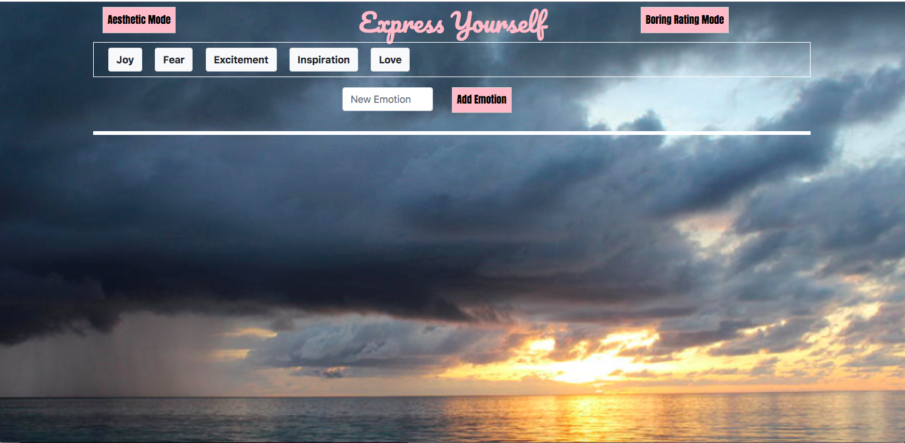

# Emotional GIPHY 
Returns relevant GIFs from GIPHY API

## Project Description
Interface for users to get a series of gifs representing how they feel, also allows for additional emotions to be added and queried

[The deployed version is accesible here](https://greysongy.github.io/giphyProject/)

)

### Technologies Used

html, css, javascript, jquery, bootstrap, Google Fonts, GIPHY API, ajax

#### Additional Notes

Modes of display have to be selected at the beggining of the game, sinze 10 images display better without the 12 column bootstrap system, but the grid system helps align components if you want to see a gif's rating